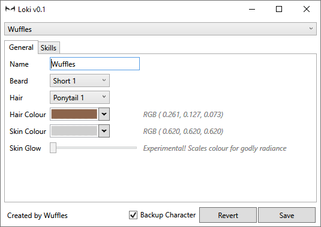
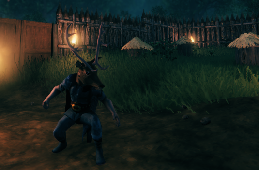
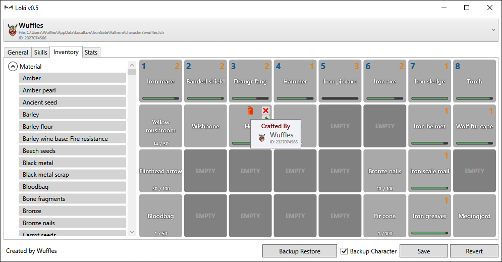
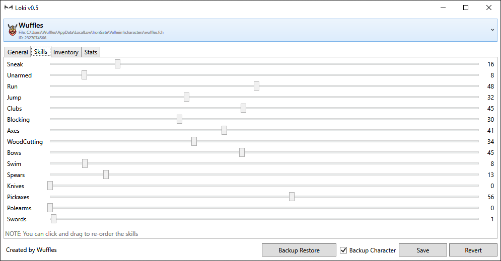
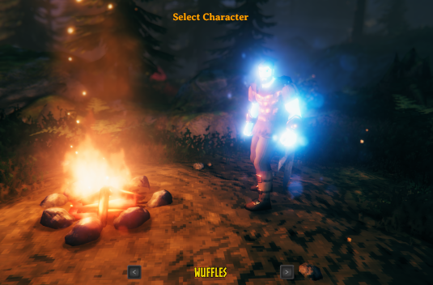

# Loki - Valheim Character Editor

This program allows editing the character files for the game Valheim (.fch)

It is currently in a very early pre-release state and therefore use only at your own risk. The game is also in pre-release so the combination means it is highly likely that things will break.

## Screenshots

## Features

- Detects game characters
- Automatic back up before saving changes
- Edit character name
- Edit beard style
- Edit hair colour
- Edit hair style
- Edit skin colour
- Make skin glow like a God (experimental)
- Edit skill values
- Use 'non standard' hair/beard styles
- Simple Inventory editor (WIP)
  - Delete items
  - Add new items from palette

## Usage

> Note: Requires the .NET runtime to be installed.
> Get it here if required: <https://dotnet.microsoft.com/download/dotnet/3.1/runtime>

No installer yet, so just simply unzip the application to any location you like & run the executable (Loki.exe).

## Backups

It's recommended to leave the backup option enabled.

Backups are created in `%LOCALAPPDATA%\TwoThreeSix\Loki\CharacterBackups`

## Coming Next

- Improvements to Inventory editor
  - Edit stack size
  - Repair
  - Upgrade / Downgrade
- Restore from backup UI for a nice recovery workflow
- Installer
- See player stats, kills, deaths etc
- World Data management (e.g. trim out bloat from old worlds)
- Tooltips & Help
- Detect game running and warn user (game could save over file at any point)
- Dark theme to protect sensitive gamer eyes
